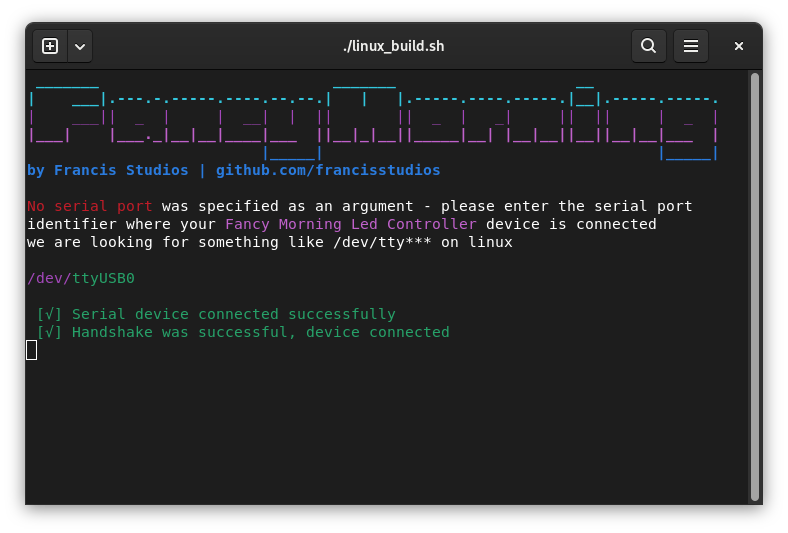

# 🌞 Fancy Morning 

Fancy Morning is an electronic device, developed by your truly `Francis Studios` to control LED strips automatically to softly wake up myself in the dark winter mornings.

This application is a CLI and a driver for managing the Fancy Morning Controller Device.
### ⬇️ Downloads 

#### 🐧 Linux
- 🟢 [fancy-client-linux-CLI](./linux/dist/fancy-client) test executable `v0.1 pre-release`

#### 🪟 Windows
- 🔴 No available port for windows yet - WIP

## 📖 How did it came to be

### 🔴 [ISSUE]

In the sumer, waking up is easy, because the sun starts to fade in slowly and around 6AM I wake up naturally, fresh and happy.

But in the winter, waking up is hard, since the sun only rises late - and I have to go to work earlier than that.

### 🟢 [SOLUTION]

As a great enginner _- that I am -_ I can design an electronic device that can PWM control some lights in my home so I wake up naturally. So I sat down in front of KiCAD and started desigining. This is the USB driver for the thing.

## 🤖 How to use

### r2.x devices

1) Connect your board to your coputer via USB - after connecting **please remove the red jumper** so the voltage regulator will not interfere with the USB comms.
2) Open the CLI application with sufficient privileges _(sudo needed for linux)_   `sudo ./fancy-client` or for windows `./fancy-client.exe`
3) You can define a port at launch time - linux `sudo ./fancy-client /dev/ttyUSB0` or for windows `./fancy-client.exe /dev/ttyUSB0` or you can ignore that and specify the port in the application - it will ask for that first anyways.
4) After successfully connecting, you can either program it or control it from the computer.
5) **PROGRAMMING:** You can program the time graph of your fade (when does it start to fade up and when should it reach 100%) - you can define a simple graph to reach your optimal settings.
6) **CONTROLLING:**  **Leave your jumper disconnected** when operating in this manner and enter the **control via server** menu. If you have a server PC _(any computer that runs 24/7)_  you can use the computers' clock to accurately schedule fading times. You can set-up a simple graph with the help of the CLI to finetune your wake up preference. Leave your device connected to the server via the USB link, and use it as a 'smart home' device.

### r3.x devices

1) Connect your board to your coputer via USB - after connecting **please remove the red jumper** so the voltage regulator will not interfere with the USB comms.
2) Open the CLI application with sufficient privileges _(sudo needed for linux)_   `sudo ./fancy-client` or for windows `./fancy-client.exe`
3) You can define a port at launch time - linux `sudo ./fancy-client /dev/ttyUSB0` or for windows `./fancy-client.exe /dev/ttyUSB0` or you can ignore that and specify the port in the application - it will ask for that first anyways.
4) After successfully connecting, you can either program it or control it from the computer.
5) **PROGRAMMING:** You can program the time graph of your fade (when does it start to fade up and when should it reach 100%) - you can define a simple graph to reach your optimal settings. **DISCLAIMER: In r2.0 devices there is no built-in clock - the device counts it's own CPU cycles to measure time - which can be quite inaccurate** - so it's an experimental feature for this version, but in some cases it can work quite acceptably. 
6) **CONTROLLING:** for r2.0 devices, this is the most reliable way to operate. **Leave your jumper disconnected** when operating in this manner and enter the **control via server** menu. If you have a server PC _(any computer that runs 24/7)_  you can use the computers' clock to accurately schedule fading times. You can set-up a simple graph with the help of the CLI to finetune your wake up preference. Leave your device connected to the server via the USB link, and use it as a 'smart home' device.